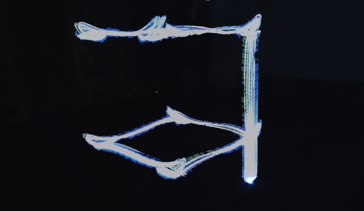
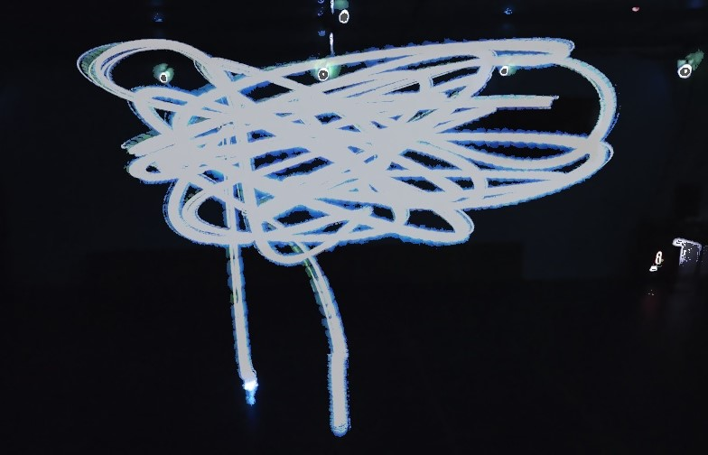
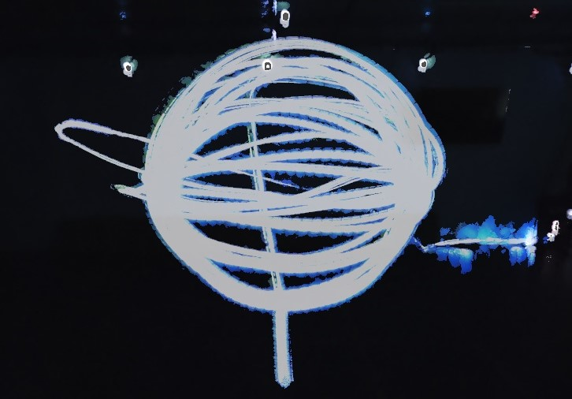
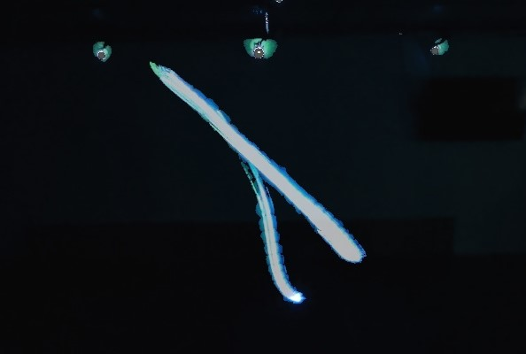

# Nano-Quadrotor System Identification Benchmark

<table>
  <tr>
    <td align="center">
      <br>
      <em>Square</em>
    </td>
    <td align="center">
      <br>
      <em>Random</em>
    </td>
    <td align="center">
      <br>
      <em>Melon</em>
    </td>
    <td align="center">
      <br>
      <em>Chirp</em>
    </td>
  </tr>
</table>

This repository accompanies the paper:

[**“Nonlinear System Identification for a Nano-drone Benchmark”**](https://www.sciencedirect.com/science/article/pii/S0967066126001152)
published in *Control Engineering Practice - Special Issue on Benchmark Control Applications*.

It provides a **reproducible benchmark for nonlinear system identification** based on **real-world flight data** collected from a **Crazyflie 2.1 Brushless nano-quadrotor**, together with reference models, training scripts, and a standardized multi-step evaluation protocol.

---

## Overview

Learning-based system identification methods are increasingly used in aerial robotics, yet fair comparison remains difficult due to the lack of shared datasets, unified evaluation protocols, and reference implementations—particularly for **nano-scale quadrotors** operating in aggressive regimes.

This repository addresses this gap by providing:

- A **real-flight nano-drone dataset** (~75k samples) with synchronized motor inputs and full-state outputs.
- **Reference identification models**, including:
  - Physics-based models
  - Purely data-driven neural models
  - Hybrid Physics + Residual models
  - Recurrent (LSTM-based) models
- A **standardized multi-step prediction benchmark**, evaluating open-loop error propagation up to 0.5 s (50 steps at 100 Hz).
- Complete **training, testing, and evaluation scripts** to reproduce the results reported in the paper.

The benchmark focuses on **system identification and prediction**, not controller design.

---

## Dataset Summary

The benchmark is built from **real flight experiments** conducted with a Crazyflie 2.1 Brushless nano-quadrotor in a motion-capture environment.

### Inputs
- Four motor angular velocities
  uₜ = [Ω₁, Ω₂, Ω₃, Ω₄]
  
### Outputs
- Position (world frame)
- Linear velocity (world frame)
- Orientation (quaternion, world frame)
- Angular velocity (body frame)

The resulting output vector has **13 dimensions**, consistent with the formulation in the paper.

### Trajectories
- `Square`
- `Random`
- `Melon`
- `Chirp`

Data from **Square**, **Random**, and **Chirp** trajectories are used for training, while **Melon** is reserved exclusively for testing, enforcing **trajectory-level generalization**.

---

## Repository Structure (main branch)
The `main` branch focuses on the PyTorch-based identification models, training, and evaluation.

```
├── models/             # Model architectures (Phys, Neural, Hybrid, LSTM)
├── dataset/            # Data loading (PyTorch Dataset)
├── train/              # Training scripts
├── test/               # Testing scripts
├── results/            # Results analysis and notebooks
├── data/               # Datasets
├── out/                # Exported models and predictions
├── scalers/            # Data scalers
├── utils/              # Utility functions (plots, metrics, etc.)
├── animations/         # Visualizations of flights
├── figures/            # Generated plots
├── requirements.txt    # Python dependencies
└── README.md
```

## Installation

### Prerequisites

- Python 3.8+
- CUDA-capable GPU (recommended for training)

### Step 1: Install Dependencies

Install the standard requirements:

```bash
pip install -r requirements.txt
```

### Step 2: Install PyTorch3D

This project uses `pytorch3d` for 3D transformations (quaternions). If installation from requirements.txt, should fail, try to build from sources:

**Build from source / Download wheels**
You can download wheels from the [PyTorch3D Wheel Builder](https://miropsota.github.io/torch_packages_builder/pytorch3d/) or follow the official [PyTorch3D installation guide](https://github.com/facebookresearch/pytorch3d/blob/main/INSTALL.md).

## Usage

### 1. Training

The `train/` directory contains scripts to train different models.

Example: Train an LSTM model
```bash
python train/train_lstm.py --train_trajs '["random", "square", "chirp"]' --epochs 500
```

Example: Train a Physics+Residual model
```bash
python train/train_phys+res.py
```

### 2. Testing

The `test/` directory contains scripts to evaluate trained models over test trajectories. Predictions are saved in `results/`

Example: Test LSTM model
```bash
python test/test_lstm.py
```

### 3. Comparison & Results

Use `results/model_comparison.py` or `results/model_comparison.ipynb` to compare different models and generate plots.

```bash
python results/model_comparison.py
```

### 4. Model Export & Profiling

Trained models can be exported and profiled on the target STM32 platform using ST Edge AI Developer Cloud.

```bash
python utils/export_models.py
```

The process to benchmark the execution time is as follows:
* Find the exported ONNX models under `out/export` and upload them to https://stedgeai-dc.st.com/home
* Select the _STM32 MCUs_ platform
* Export in `float32` precision, with no quantization
* Select the _Balance between RAM size and inference time_ mode
* Profile on the _STM32F469I-DISCO_ board, which matches the Crazyflie's STM32F405 in terms of CPU micro-architecture and memory hierarchy
* Rescale the profiled execution times to account for the different clock rates (180MHz vs 168MHz, respectively)

## Models Description

`models/models.py` implements:

1.  **`PhysQuadModel`**: Physics-based model using rigid body dynamics and RK4 integration.
2.  **`ResidualQuadModel`**: Purely data-driven MLP model.
3.  **`PhysResQuadModel`**: Hybrid model (Physics + Neural Residual).
4.  **`QuadLSTM`**: LSTM-based model for temporal dependencies.

## EXTRA RESOURCES

Additional resources are available in the `.dev` branch (check out `origin/dev`), including:

-   **`simulator/`**: A high-fidelity JAX-based quadrotor dynamics simulator.
-   **`processing/`**: Scripts for processing raw ROS bag files into CSV/Parquet formats used by this repo.
-   **`wheels/`**: Pre-built wheels for PyTorch3D (check if they match your system).

## Publications
If you use this work in an academic context, we kindly ask you to cite the following publication:
* R. Busetto, E. Cereda, M. Forgione, G. Maroni, D. Piga, D. Palossi, ‘Nonlinear System Identification for a Nano-drone Benchmark’, Control Engineering Practice, 2026 [ScienceDirect](https://www.sciencedirect.com/science/article/pii/S0967066126001152) [arXiv](https://arxiv.org/abs/2512.14450).
  
```bibtex
@article{BUSETTO2026106871,
title = {Nonlinear system identification for a nano-drone benchmark},
journal = {Control Engineering Practice},
volume = {172},
pages = {106871},
year = {2026},
issn = {0967-0661},
doi = {https://doi.org/10.1016/j.conengprac.2026.106871},
url = {https://www.sciencedirect.com/science/article/pii/S0967066126001152},
author = {Riccardo Busetto and Elia Cereda and Marco Forgione and Gabriele Maroni and Dario Piga and Daniele Palossi},
}
```

## Contributors
Riccardo Busetto<sup>*1</sup>,
Elia Cereda<sup>*1</sup>,
Marco Forgione<sup>1</sup>,
Gabriele Maroni<sup>1</sup>,
Dario Piga<sup>1</sup>,
Daniele Palossi<sup>1,2</sup>.

<sup>* </sup>Equal contribution.<br>
<sup>1 </sup>Dalle Molle Institute for Artificial Intelligence (IDSIA), USI and SUPSI, Switzerland.<br>
<sup>2 </sup>Integrated Systems Laboratory (IIS) of ETH Zürich, Switzerland.<br>
