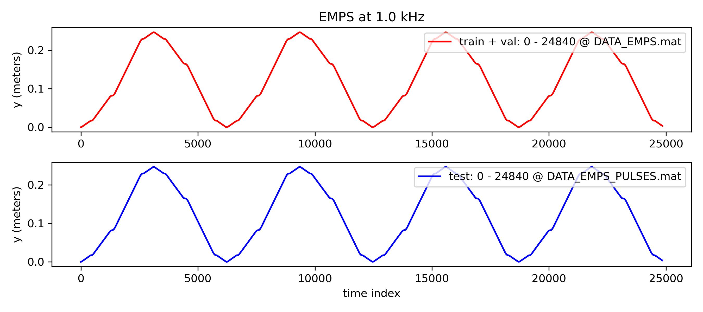
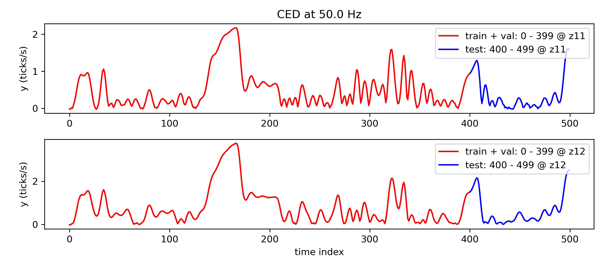
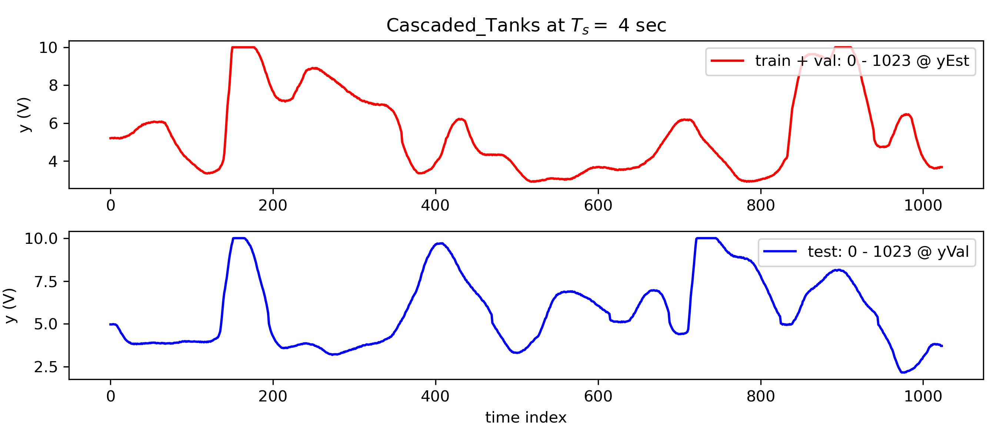
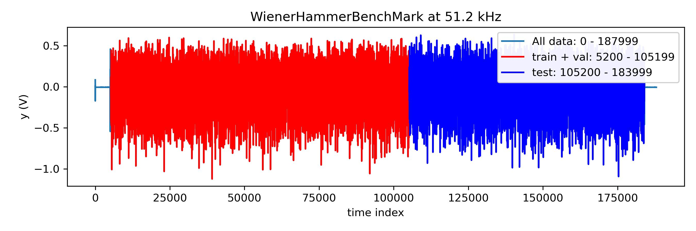
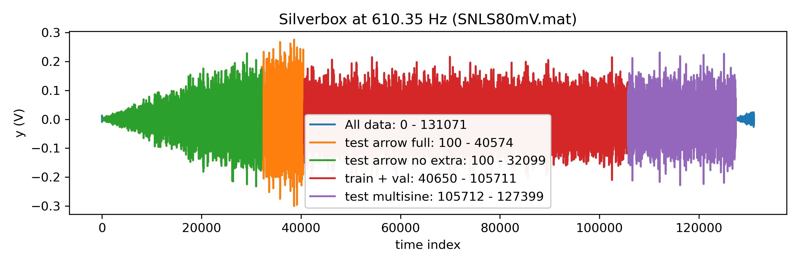
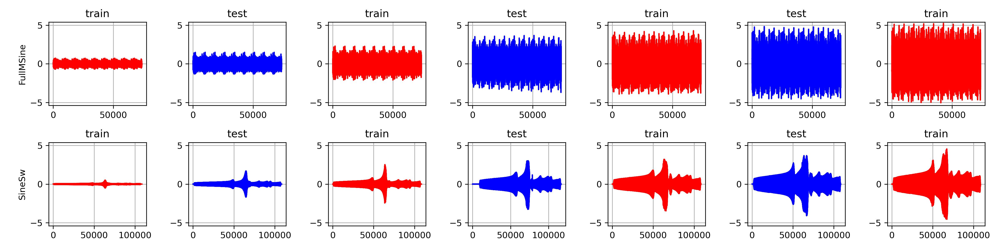
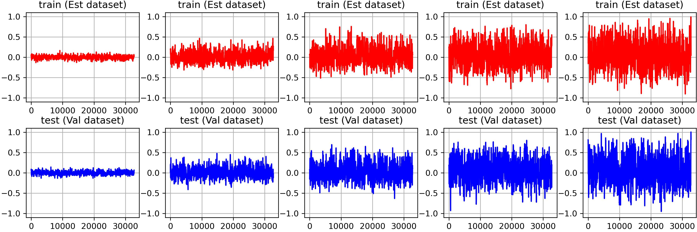
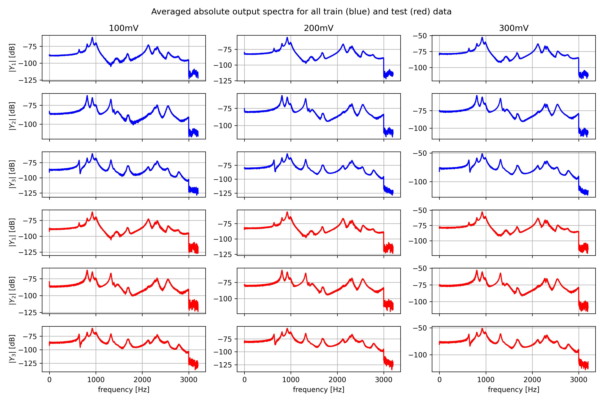
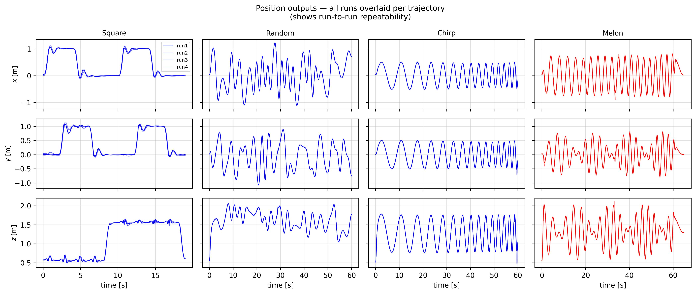

# nonlinear_benchmarks
 
The official dataloader of [nonlinearbenchmark.org](http://www.nonlinearbenchmark.org/). This toolbox simplifies the process of downloading, loading, and splitting various datasets available on the website. It also provides basic instructions on submitting benchmark results.

## Usage Example

https://www.nonlinearbenchmark.org/benchmarks/wiener-hammerstein is loaded as:

```python
import nonlinear_benchmarks
train_val, test = nonlinear_benchmarks.WienerHammerBenchMark()

print(train_val) 
# prints : Input_output_data "train WH" u.shape=(100000,) y.shape=(100000,)
#          sampling_time=1.953e-05
print(test)
# prints: Input_output_data "test WH" u.shape=(78800,) y.shape=(78800,) 
#         sampling_time=1.953e-05 state_initialization_window_length=50

sampling_time = train_val.sampling_time # in seconds
u_train, y_train = train_val            # to unpack or use train_val.u, train_val.y
u_test, y_test   = test                 # to unpack or use test.u,      test.y
print(test.state_initialization_window_length) 
#state_initialization_window_length = The number of samples that can be used at the 
#                                     start of the test set to initialize the model state.

print(train_val[:100])                  # creates a slice of the train_val data from 0 to 100
```

## Useful Options

When using the `WienerHammerBenchMark` (or any other benchmark function), you can customize the behavior with the following options:

 * `data_file_locations=True` : Returns the raw data file locations.
 * `train_test_split=False` : Retrieves the entire dataset without splitting.
 * `force_download=True` : Forces (re-)downloading of benchmark files.
 * `url=` : Allows manual override of the download link (contact maintainers if the default link is broken).
 * `atleast_2d=True`: Converts input/output arrays to at least 2D shape (e.g. `u.shape = (250,)` becomes `u.shape = (250, 1)`).
 * `always_return_tuples_of_datasets=True`: Even if there is only a single training or test set a list is still returned (i.e. adds `[train] if not isinstance(train,list) else train`)

# Install

```
pip install nonlinear-benchmarks
```

# Datasets

Multiple datasets have been implemented with an official train test split which are given below. 

(p.s. datasets without an official train test split can be found in `nonlinear_benchmarks.not_splitted_benchmarks`)

## [Electro-Mechanical Positioning System (EMPS)](https://www.nonlinearbenchmark.org/benchmarks/emps)



```python
train_val, test = nonlinear_benchmarks.EMPS()
print(test.state_initialization_window_length) # = 20
train_val_u, train_val_y = train_val
test_u, test_y = test
```

Benchmark Results Submission template: [submission_examples/EMPS.py](submission_examples/EMPS.py) (report accuracy in [ticks/s])


## [Coupled Electric Drives (CED)](https://www.nonlinearbenchmark.org/benchmarks/coupled-electric-drives)



```python
train_val, test = nonlinear_benchmarks.CED()
print(test[0].state_initialization_window_length) # = 10
(train_val_u_1, train_val_y_1), (train_val_u_2, train_val_y_2) = train_val
(test_u_1, test_y_1), (test_u_2, test_y_2) = test
```

This dataset consists of two time series where the first has a low input amplitude (`train_val_1` and `test_1`) and the second a high input amplitude (`train_val_2` and `test_2`).  

You can use both training sets in your training, and please report the RMSE values on both test sets separately. 

Benchmark Results Submission template: [submission_examples/CED.py](submission_examples/CED.py) (report accuracy in [mm])


## [Cascaded Tanks with Overflow (Cascaded_Tanks)](https://www.nonlinearbenchmark.org/benchmarks/cascaded-tanks)



```python
train_val, test = nonlinear_benchmarks.Cascaded_Tanks()
print(test.state_initialization_window_length) # = 50
train_val_u, train_val_y = train_val
test_u, test_y = test
```

Benchmark Results Submission template: [submission_examples/Cascaded_Tanks.py](submission_examples/Cascaded_Tanks.py) (report accuracy in [V])

## [Wiener-Hammerstein System (WienerHammerBenchMark)](https://www.nonlinearbenchmark.org/benchmarks/wiener-hammerstein)



```python
train_val, test = nonlinear_benchmarks.WienerHammerBenchMark()
print(test.state_initialization_window_length) # = 50
train_val_u, train_val_y = train_val
test_u, test_y = test
```

Benchmark Results Submission template: [submission_examples/WienerHammerBenchMark.py](submission_examples/WienerHammerBenchMark.py) (report accuracy in [mV])


## [Silverbox](https://www.nonlinearbenchmark.org/benchmarks/silverbox)



```python
train_val, test = nonlinear_benchmarks.Silverbox()
multisine_train_val = train_val
print(test[0].state_initialization_window_length) # = 50 (for all test sets)
test_multisine, test_arrow_full, test_arrow_no_extrapolation = test
```

Benchmark Results Submission template: [submission_examples/silverbox.py](submission_examples/silverbox.py) (report accuracy in [mV])

Note that the `test_arrow_no_extrapolation` is a subset of the `test_arrow_full`.

## [F-16 Ground Vibration Test](https://www.nonlinearbenchmark.org/benchmarks/f-16-gvt)



```python
train_val, test = nonlinear_benchmarks.F16()
train_val #8 datasets with lenghts 73728 and 108477
test #6 datasets with lenghts 73728 and 108477
```

Benchmark Results Submission template: [submission_examples/F16.py](submission_examples/F16.py)

## [Parallel Wiener-Hammerstein System](https://www.nonlinearbenchmark.org/benchmarks/parallel-wiener-hammerstein)



```python
train_val, test = nonlinear_benchmarks.ParWH()
train_val #100 datsets with each a length of 32768 with 2 periods created with multisine inputs with 5 different amplitudes and 20 different multisine phases
test #5 datasets with each a length of 32768 with 2 periods of multisine inputs with 5 different amplitudes
```

Benchmark Results Submission template: [submission_examples/ParallelWH.py](submission_examples/ParallelWH.py) (report accuracy in [mV])

## [Fine Steering Mirror](https://www.nonlinearbenchmark.org/benchmarks/fine-steering-mirror)



```python
train_val, test = nonlinear_benchmarks.FineSteeringMirror() # system with nu=3 inputs and ny=3 outputs
train_val # P=2 steady-state periods and R=6 realizations of a random-phase multisine of N=8192 samples each, stored as (N, {nu, ny}, R, P) tensors for RMS excitation amplitudes {100, 200, 300} mV. Input signals are orthogonal: in each consecutive group of 3 realizations (2 groups total), the random phases are chosen such that FRM estimation is optimally conditioned.
test # (N, {nu, ny}, R_test, P) tensors with R_test=3 at the same RMS amplitudes. The input signals are again orthogonal.
```

Benchmark Results Submission template: [submission_examples/FineSteeringMirror.py](submission_examples/FineSteeringMirror.py) (report accuracy in [µm])

## [NanoDrone](https://www.nonlinearbenchmark.org/benchmarks/nanodrone)



```python
train, test = nonlinear_benchmarks.NanoDrone()
# train: 9 datasets (square/random/chirp x 3 runs), u.shape=(N, 4), y.shape=(N, 13)
# test:  3 datasets (melon x 3 runs),                u.shape=(N, 4), y.shape=(N, 13)
print(train[0].state_initialization_window_length) # = 50 (0.5 s at 100 Hz, for all datasets)

sampling_time = train[0].sampling_time  # = 0.01 s (100 Hz)
u_train, y_train = train[0]             # e.g. square run1 — or loop over all train datasets
u_test,  y_test  = test[0]              # e.g. melon run1  — or loop over all test datasets

# y columns: [x, y, z, vx, vy, vz, qx, qy, qz, qw, wx, wy, wz]
# u columns: [m1_rads, m2_rads, m3_rads, m4_rads]

# Optional: load body-frame accelerations as auxiliary outputs (not part of the standard benchmark)
train, test = nonlinear_benchmarks.NanoDrone(include_accelerations=True)
# y.shape=(N, 16) — last 3 columns are [ax_body, ay_body, az_body] in [m/s²]
```

This benchmark is based on real-world flight data from a Crazyflie 2.1 Brushless nano-quadrotor (~50 g),
recorded in a motion-capture arena across four aggressive trajectories. The train/test split is at the
trajectory level: Square, Random, and Chirp trajectories are used for training, while the Melon
trajectory is reserved exclusively for testing, enforcing trajectory-level generalization.

The evaluation protocol is based on multi-step open-loop prediction up to H=50 steps (0.5 s).
Metrics are the mean absolute error (MAE) for position [m], linear velocity [m/s], orientation
(geodesic distance on SO(3)) [rad], and angular velocity [rad/s], evaluated at horizons h=1, 10, 50
and as a cumulative simulation error (SimErr = Σ MAE_h for h=1..50). Results are averaged across
the 3 Melon test runs.

Benchmark Results Submission template: [submission_examples/NanoDrone.py](submission_examples/NanoDrone.py)
(report SimErr for position [m], linear velocity [m/s], orientation [rad], angular velocity [rad/s])

# Error Metrics

We also provide error metrics in `nonlinear_benchmarks.error_metrics`.

```python
from nonlinear_benchmarks.error_metrics import RMSE, NRMSE, R_squared, MAE, fit_index

#generate example ouput data and prediction 
y_true = np.random.randn(100)
y_model = y_true + np.random.randn(100)/100

print(f"RMSE: {RMSE(y_true, y_model)} (Root Mean Square Error)")
print(f"NRMSE: {NRMSE(y_true, y_model)} (Normalized Root Mean Square Error)")
print(f"R-squared: {R_squared(y_true, y_model)} (coefficient of determination R^2)")
print(f'MAE: {MAE(y_true, y_model)} (Mean Absolute value Error)')
print(f"fit index: {fit_index(y_true, y_model)} (https://arxiv.org/pdf/1902.00683.pdf page 31)")
```

The NanoDrone benchmark uses a custom multi-horizon evaluation protocol with physically meaningful metrics (geodesic orientation error on SO(3), per-horizon MAE, and cumulative simulation error). These are provided separately in `nonlinear_benchmarks.nanodrone_error_metrics`:
 
```python
from nonlinear_benchmarks.nanodrone_error_metrics import compute_errors, compute_simerr, print_results
 
# compute_errors(df, max_horizon=50)
#   Returns dict with keys 'pos', 'vel', 'rot', 'omega', each mapping h -> MAE.
#   df must contain ground truth columns:
#     [t, x, y, z, vx, vy, vz, qx, qy, qz, qw, wx, wy, wz]
#   and prediction columns: {state}_pred_h{1..max_horizon}
 
# compute_simerr(metrics, max_horizon=50)
#   Returns (sim_pos, sim_vel, sim_rot, sim_omega):
#   cumulative MAE summed over h = 1..max_horizon  [m, m/s, rad, rad/s]
 
# print_results(metrics, label='Model', max_horizon=50)
#   Prints a formatted table at h=1, 10, 50 and SimErr,
#   plus the 4 numbers to submit.
```
 
See [submission_examples/NanoDrone.py](submission_examples/NanoDrone.py) for a complete usage example.
 

# Benchmark Result Submission

If you would like to submit a benchmark result this can be done through this [google form](https://forms.gle/JF9zR9M9Td9GJgDx8). When reporting the benchmark results please use use the toolbox as follows;

```python
train_val, test = nonlinear_benchmarks.WienerHammerBenchMark()
n = test.state_initialization_window_length

# y_model = your model output using only test.u and test.y[:n]

RMSE_result = RMSE(test.y[n:], y_model[n:]) #skip the first n
print(RMSE_result) #report this number
```

For details specific to each benchmark see the submission template: [submission_examples/](submission_examples/)